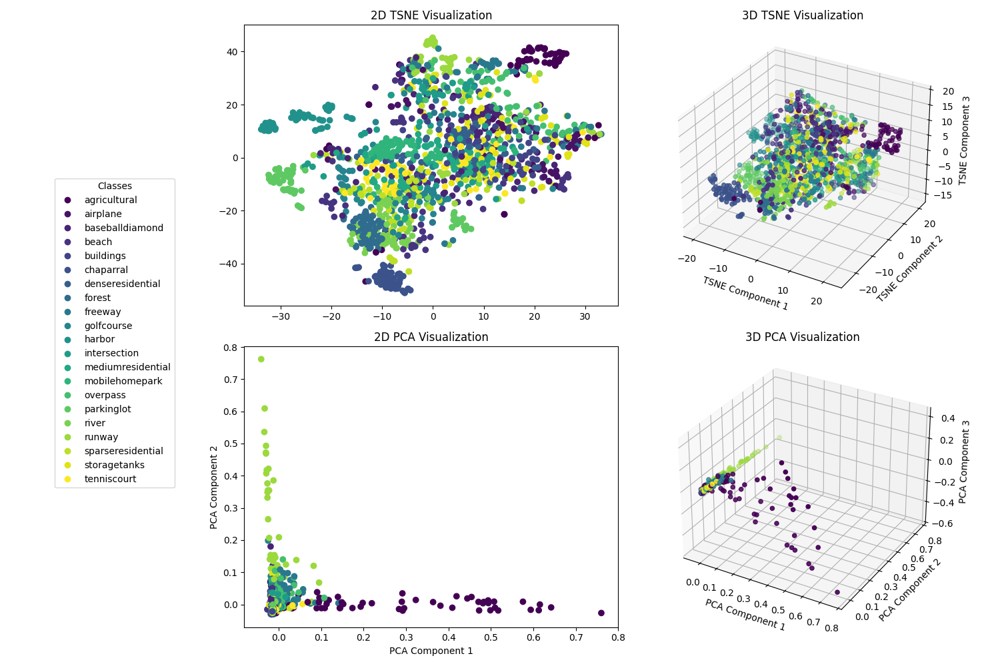
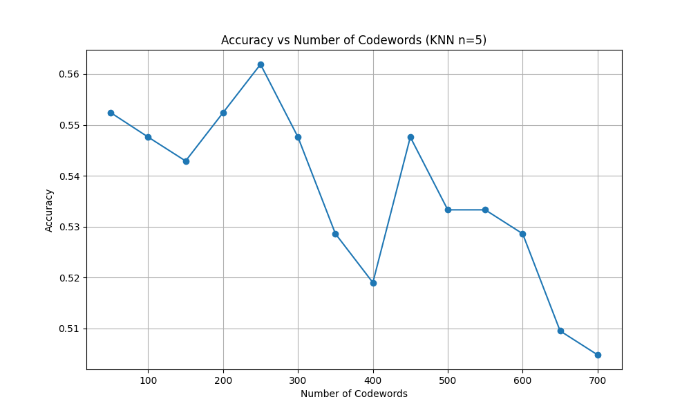

# Image Classification using SIFT and Bag of Visual Words

This assignment implements image classification using SIFT (Scale-Invariant Feature Transform) features and the Bag of Visual Words (BoVW) approach. The implementation uses K-Means clustering for vocabulary generation and K-Nearest Neighbors (KNN) for classification.

## Dataset

The project uses the UC Merced Land Use Dataset, which contains aerial images of different land use categories.

Dataset: https://vincmazet.github.io/bip/detection/edges.html

## Implementation Details

### Feature Extraction

- SIFT (Scale-Invariant Feature Transform) is used to extract keypoints and descriptors from images
- Each keypoint descriptor is a 128-dimensional vector
- OpenCV's SIFT implementation is utilized

### Bag of Visual Words Approach

1. **Feature Extraction**: SIFT features are extracted from all training images
2. **Vocabulary Generation**: K-Means clustering is applied to create a visual vocabulary
3. **Image Representation**: Each image is represented as a histogram of visual words
4. **Classification**: KNN classifier is used for final classification

### Data Split

- Training: 70%
- Validation: 10%
- Testing: 20%

## Results

### Validation Performance

The model was tested with different vocabulary sizes (K) and KNN configurations. Here are the validation accuracies:

| Codewords | Accuracy |
| --------- | -------- |
| 50        | 0.5524   |
| 100       | 0.5476   |
| 150       | 0.5429   |
| 200       | 0.5524   |
| 250       | 0.5619   |
| 300       | 0.5476   |
| 350       | 0.5286   |
| 400       | 0.5190   |
| 450       | 0.5476   |
| 500       | 0.5333   |
| 550       | 0.5333   |
| 600       | 0.5286   |
| 650       | 0.5095   |
| 700       | 0.5048   |

### Best Model Configuration

- Validation: K=250 codewords with n=5 neighbors (56.19% accuracy)
- Testing: K=50 codewords with n=5 neighbors (58.57% accuracy)

## Analysis

### Classification Performance

- The model achieved best validation accuracy with 250 codewords
- However, we also tested with some other codewords which had close accuracies in validation. The model with 50 codewords performed better during the testing phase.
- Performance generally degraded with vocabulary sizes larger than 250

### Visualization

The project includes both t-SNE visualizations of the feature space and the accuracy plot for different number of codewords:

- 2D and 3D t-SNE visualizations show cluster formations:
  

- Line graph of the accuracy vs the number of codewords:
  
