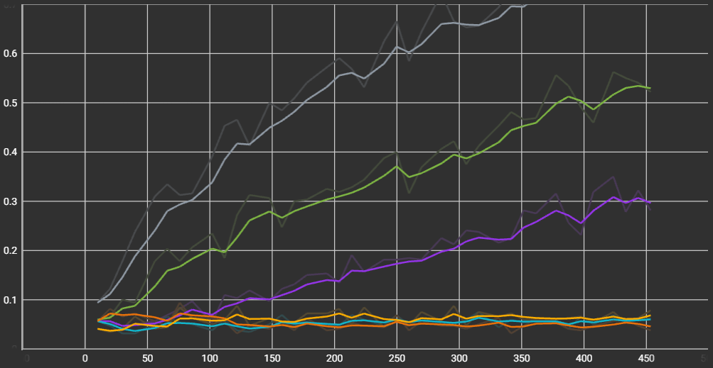
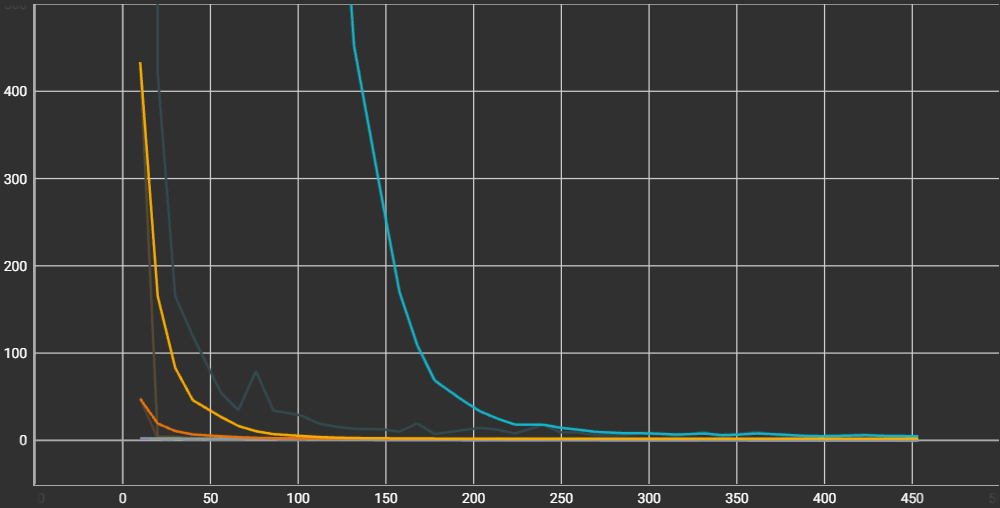
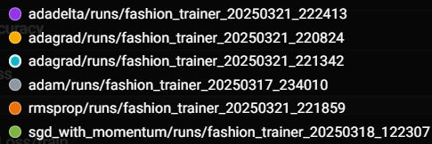

# Optimization Algorithms Comparison for Neural Networks

This assignment explores the performance of different optimization algorithms in training neural networks. We implemented and compared various optimizers to understand their impact on model convergence and accuracy.

## Optimizers Implemented

We tested the following optimization algorithms:

- AdaGrad
- AdaDelta
- Adam
- SGD with Momentum
- RMSprop

## Results

### Accuracy Plot

### Loss Plot

### Legend for above plots

## Conclusions

While all optimizers eventually reached the same loss, the Adam optimizer clearly outperforms all other optimizers in speed as well as training accuracy.
